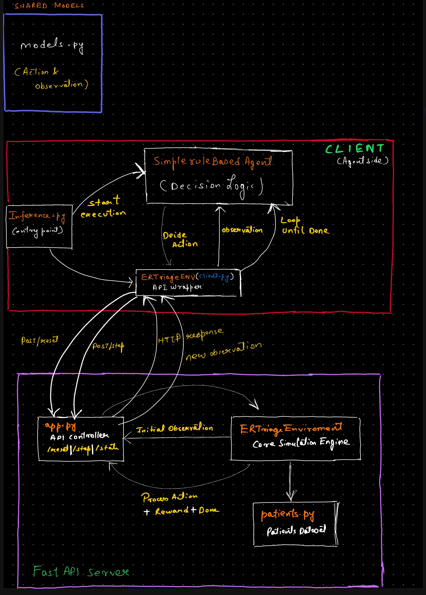
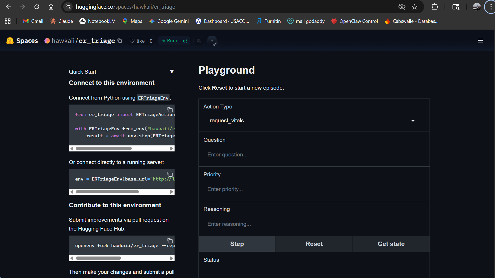
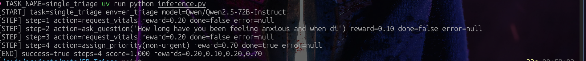

# ER Triage Environment

An OpenEnv environment where an AI agent triages emergency room patients using the Emergency Severity Index (ESI) protocol. The agent must gather information (vitals, history) and assign the correct priority level, balancing speed and accuracy.

## Architecture



## Deployed Environment

**Live Space:** [https://huggingface.co/spaces/hawkaii/er_triage](https://huggingface.co/spaces/hawkaii/er_triage)



## Inference Logs



## Quick Start

The simplest way to use the ER Triage environment is through the `ERTriageEnv` class:

```python
from er_triage import ERTriageAction, ERTriageEnv

try:
    # Create environment from Docker image
    er_triage_env = ERTriageEnv.from_docker_image("er_triage-env:latest")

    # Reset
    result = er_triage_env.reset()
    print(f"Reset: {result.observation.chief_complaint}")

    # Send multiple messages
    messages = ["Hello, World!", "Testing echo", "Final message"]

    for msg in messages:
        result = er_triage_env.step(ERTriageAction(action_type="ask_question", question=msg))
        print(f"Sent: '{msg}'")
        print(f"  → Reward: {result.reward}")

finally:
    # Always clean up
    er_triage_env.close()
```

That's it! The `ERTriageEnv.from_docker_image()` method handles:
- Starting the Docker container
- Waiting for the server to be ready
- Connecting to the environment
- Container cleanup when you call `close()`

## Building the Docker Image

Before using the environment, you need to build the Docker image:

```bash
# From project root
docker build -t er_triage-env:latest -f server/Dockerfile .
```

## Deploying to Hugging Face Spaces

You can easily deploy your OpenEnv environment to Hugging Face Spaces using the `openenv push` command:

```bash
# From the environment directory (where openenv.yaml is located)
openenv push

# Or specify options
openenv push --namespace my-org --private
```

The `openenv push` command will:
1. Validate that the directory is an OpenEnv environment (checks for `openenv.yaml`)
2. Prepare a custom build for Hugging Face Docker space (enables web interface)
3. Upload to Hugging Face (ensuring you're logged in)

### Prerequisites

- Authenticate with Hugging Face: The command will prompt for login if not already authenticated

### Options

- `--directory`, `-d`: Directory containing the OpenEnv environment (defaults to current directory)
- `--repo-id`, `-r`: Repository ID in format 'username/repo-name' (defaults to 'username/env-name' from openenv.yaml)
- `--base-image`, `-b`: Base Docker image to use (overrides Dockerfile FROM)
- `--private`: Deploy the space as private (default: public)

### Examples

```bash
# Push to your personal namespace (defaults to username/env-name from openenv.yaml)
openenv push

# Push to a specific repository
openenv push --repo-id my-org/my-env

# Push with a custom base image
openenv push --base-image ghcr.io/meta-pytorch/openenv-base:latest

# Push as a private space
openenv push --private

# Combine options
openenv push --repo-id my-org/my-env --base-image custom-base:latest --private
```

After deployment, your space will be available at:
`https://huggingface.co/spaces/<repo-id>`

The deployed space includes:
- **Web Interface** at `/web` - Interactive UI for exploring the environment
- **API Documentation** at `/docs` - Full OpenAPI/Swagger interface
- **Health Check** at `/health` - Container health monitoring
- **WebSocket** at `/ws` - Persistent session endpoint for low-latency interactions

## Environment Details

### Action
**ERTriageAction**: Contains fields for triage actions
- `action_type` (str) - One of: `request_vitals`, `ask_question`, `assign_priority`
- `question` (str, optional) - Question to ask the patient
- `priority` (str, optional) - Assigned ESI priority level
- `reasoning` (str, optional) - Agent's reasoning

### Observation
**ERTriageObservation**: Contains the triage response and metadata
- `patient_id` (str) - The patient identifier
- `chief_complaint` (str) - Patient's chief complaint
- `available_actions` (list) - Actions available at current step
- `vitals` (dict, optional) - Patient vitals if requested
- `question_answer` (str, optional) - Answer to a asked question
- `reward` (float) - Reward for the last action
- `done` (bool) - Whether the episode is complete

### Reward (Partial Progress)
Rewards are in `[0, 1]` with partial progress signals at each step:
- `request_vitals`: `+0.2`
- `ask_question`: `+0.1`
- `assign_priority` (correct): `+0.7`
- `assign_priority` (wrong): `+0.0`
- Max per patient: `1.0` (vitals + question + correct priority)

## Advanced Usage

### Connecting to an Existing Server

If you already have an ER Triage environment server running, you can connect directly:

```python
from er_triage import ERTriageEnv

# Connect to existing server
er_triage_env = ERTriageEnv(base_url="<ENV_HTTP_URL_HERE>")

# Use as normal
result = er_triage_env.reset()
result = er_triage_env.step(ERTriageAction(action_type="request_vitals"))
```

Note: When connecting to an existing server, `er_triage_env.close()` will NOT stop the server.

### Using the Context Manager

The client supports context manager usage for automatic connection management:

```python
from er_triage import ERTriageAction, ERTriageEnv

# Connect with context manager (auto-connects and closes)
with ERTriageEnv(base_url="http://localhost:8000") as env:
    result = env.reset()
    print(f"Reset: {result.observation.chief_complaint}")
    # Multiple steps with low latency
    for action_type in ["request_vitals", "assign_priority"]:
        result = env.step(ERTriageAction(action_type=action_type))
        print(f"Reward: {result.reward}")
```

The client uses WebSocket connections for:
- **Lower latency**: No HTTP connection overhead per request
- **Persistent session**: Server maintains your environment state
- **Efficient for episodes**: Better for many sequential steps

### Concurrent WebSocket Sessions

The server supports multiple concurrent WebSocket connections. To enable this,
modify `server/app.py` to use factory mode:

```python
# In server/app.py - use factory mode for concurrent sessions
app = create_app(
    ERTriageEnvironment,  # Pass class, not instance
    ERTriageAction,
    ERTriageObservation,
    max_concurrent_envs=4,  # Allow 4 concurrent sessions
)
```

Then multiple clients can connect simultaneously:

```python
from er_triage import ERTriageAction, ERTriageEnv
from concurrent.futures import ThreadPoolExecutor

def run_episode(client_id: int):
    with ERTriageEnv(base_url="http://localhost:8000") as env:
        result = env.reset()
        for i in range(10):
            result = env.step(ERTriageAction(action_type="request_vitals"))
        return client_id, result.reward

# Run 4 episodes concurrently
with ThreadPoolExecutor(max_workers=4) as executor:
    results = list(executor.map(run_episode, range(4)))
```

## Development & Testing

### Direct Environment Testing

Test the environment logic directly without starting the HTTP server:

```bash
# From the server directory
python3 server/er_triage_environment.py
```

This verifies that:
- Environment resets correctly
- Step executes actions properly
- State tracking works
- Rewards are calculated correctly

### Running Locally

Run the server locally for development:

```bash
uvicorn server.app:app --reload
```

## Project Structure

```
ER_Triage/
├── __init__.py            # Module exports
├── README.md              # This file
├── openenv.yaml           # OpenEnv manifest
├── pyproject.toml         # Project metadata and dependencies
├── uv.lock                # Locked dependencies (generated)
├── client.py              # ERTriageEnv client
├── models.py              # Action and Observation models
├── inference.py           # LLM-powered inference (OpenAI client)
├── pics/
│   ├── architecture.png       # Architecture diagram
│   ├── environment_huggingface_spaces.png  # HF Spaces screenshot
│   └── inferenece_logs.png    # Inference output logs
├── data/
│   ├── __init__.py
│   └── patients.py        # Patient dataset (11 patients, 3 tricky)
└── server/
    ├── __init__.py        # Server module exports
    ├── er_triage_environment.py  # Core environment logic
    ├── app.py             # FastAPI application (HTTP + WebSocket endpoints)
    ├── requirements.txt   # Server dependencies
    └── Dockerfile         # Container image definition
```
